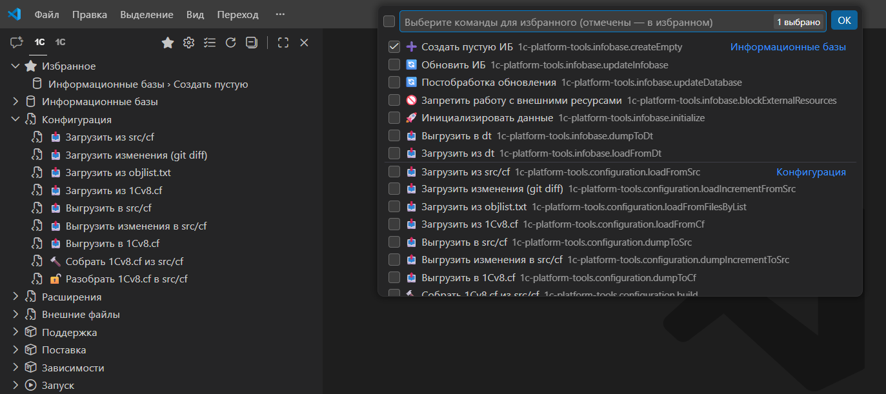

# Шаг 3 — Панель команд

|                                               |                                                                                                                                                                                                                                                                                                                                                                                                                                                                                                        |
|:---------------------------------------------:|:-------------------------------------------------------------------------------------------------------------------------------------------------------------------------------------------------------------------------------------------------------------------------------------------------------------------------------------------------------------------------------------------------------------------------------------------------------------------------------------------------------|
|  | После открытия проекта на боковой панели появляется раздел **«1C: Инструменты»** с деревом команд.  **Дерево** группирует команды по смыслу: информационные базы, конфигурация, расширения, запуск, тестирование и др.  Чтобы не искать нужное каждый раз — добавьте часто используемые в **избранное** через **«Настроить избранное»**.  Команды также доступны из палитры: нажмите `Ctrl+Shift+P` (Mac: `Cmd+Shift+P`) и введите **«1C»** — фильтр покажет все команды расширения. |
