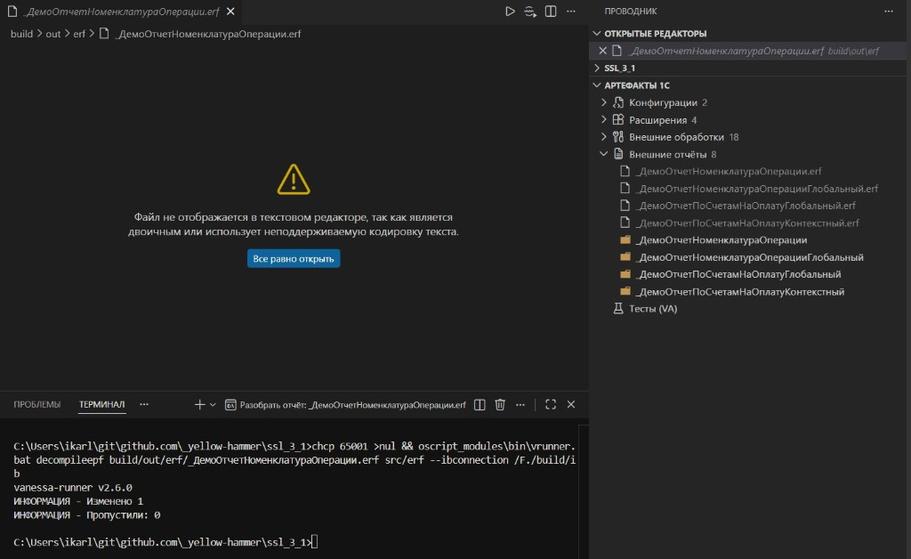

# Шаг 4 — Панель артефактов

Панель **«Артефакты 1С»** на боковой панели (см. Проводник) показывает конфигурации, расширения, внешние обработки, отчёты и feature-файлы проекта.

Для бинарных файлов (`.cf`, `.cfe`, `.epf`, `.erf`) доступна кнопка **«Разобрать»** в панели редактора. Из дерева артефактов: **Открыть**, **Собрать** или **Разобрать**, для feature — **Запустить** (Vanessa-Automation). В контекстном меню  — те же команды и **Удалить**.
