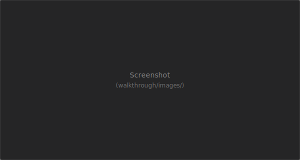

**Шаг 4.** После открытия папки проекта 1С на боковой панели появляется раздел **«1C: Инструменты»**.

- **Дерево проекта** — конфигурация, расширения, внешние отчёты и обработки, задачи, конфигурации запуска.
- **Избранное** — закрепите часто используемые команды (сборка, тесты, запуск) через **«Настроить избранное»**.
- **Список дел** — панель внизу с поиском TODO/FIXME по проекту.
- **С чего начать?** — эта пошаговая страница и быстрые команды для типовых действий.

Команды также доступны из палитры (**Ctrl+Shift+P**): наберите «1C» или «1с» для фильтра по расширению.
