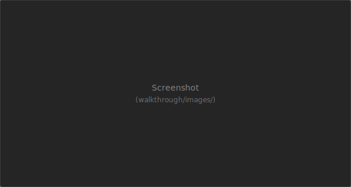

# Шаг 4 — Служебные файлы

Служебные файлы проекта хранят параметры подключения к информационной базе, настройки отладки и исключения для Git.

**env.json** — строка подключения к ИБ (`--ibconnection`), используется командами vrunner. **launch.json** — конфигурации отладки в VS Code. **.gitignore** и **.gitattributes** помогают корректно работать с репозиторием.

> **Разрабатывается.** Единый интерфейс настройки этих файлов будет добавлен позже. Сейчас вы можете открыть env.json и launch.json через дерево (Конфигурации запуска) или редактировать файлы вручную.
